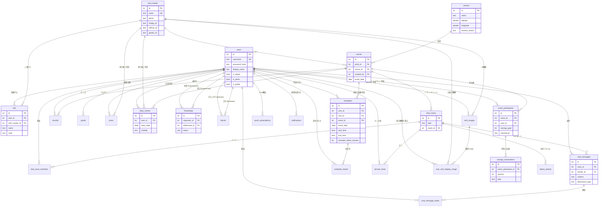

# DBテーブル定義（推しログ / OshiLog）

- DB: PostgreSQL（Railway）。接続は `backend/db.js` の `pg` プールで `DATABASE_URL` を使用。
- スキーマはサーバー起動時に `backend/db.js` の DDL で自動作成・マイグレーションされる
  （`CREATE TABLE IF NOT EXISTS` ＋ `ALTER TABLE ... ADD COLUMN IF NOT EXISTS` の冪等方式）。
- `DATE` 型はタイムゾーン変換せず `'YYYY-MM-DD'` 文字列のまま扱う設定（`types.setTypeParser(1082)`）。
- 以下は ALTER で追加されたカラムも統合した **現在の完全な形**（全25テーブル）。

## 1. users（ユーザー）

| カラム | 型 | NULL | デフォルト | 備考 |
|---|---|---|---|---|
| id | SERIAL | NOT NULL | 自動採番 | PK |
| username | TEXT | NOT NULL | - | ログインID。UNIQUE |
| password_hash | TEXT | 許容 | - | `scrypt$ソルト$ハッシュ` 形式 |
| display_name | TEXT | 許容 | - | 表示名（未設定時はusernameで埋める移行あり） |
| avatar | TEXT | 許容 | - | プロフィールアイコン（Base64データURL） |
| bio | TEXT | 許容 | - | 自己紹介（200字まで） |
| is_admin | BOOLEAN | NOT NULL | false | 管理者フラグ |
| is_client | BOOLEAN | NOT NULL | false | クライアント（発注者）ロール。案内タブが出る |
| is_public | BOOLEAN | NOT NULL | true | アカウント公開/非公開 |
| auto_reject_requests | BOOLEAN | NOT NULL | false | 推し友申請の自動拒否設定 |
| notify_friend_request | BOOLEAN | NOT NULL | true | 通知カテゴリ：推し友申請・承認 |
| notify_chat_dm | BOOLEAN | NOT NULL | true | 通知カテゴリ：DM |
| notify_chat_group | BOOLEAN | NOT NULL | true | 通知カテゴリ：グループトーク |
| notify_event | BOOLEAN | NOT NULL | true | 通知カテゴリ：イベントリマインド |
| created_at | TIMESTAMPTZ | NOT NULL | now() | |
| updated_at | TIMESTAMPTZ | NOT NULL | now() | |

## 2. oshi_master（推しマスター：全体共有の推し実体）

| カラム | 型 | NULL | デフォルト | 備考 |
|---|---|---|---|---|
| id | SERIAL | NOT NULL | 自動採番 | PK |
| name | TEXT | NOT NULL | - | UNIQUE（同名の推しはここに集約） |
| genre | TEXT | NOT NULL | 'その他' | ジャンル |
| image_url | TEXT | 許容 | - | 代表画像（Base64データURL） |
| official_url | TEXT | 許容 | - | 公式サイトURL（管理者のみ編集） |
| goods_url | TEXT | 許容 | - | グッズサイトURL（管理者のみ編集） |
| created_at | TIMESTAMPTZ | NOT NULL | now() | |

## 3. oshi（ユーザー個人の推し登録）

| カラム | 型 | NULL | デフォルト | 備考 |
|---|---|---|---|---|
| id | SERIAL | NOT NULL | 自動採番 | PK |
| user_id | INTEGER | NOT NULL | - | FK → users(id) ON DELETE CASCADE |
| name | TEXT | NOT NULL | - | 推し名 |
| category | TEXT | NOT NULL | 'アイドル' | 旧ジャンル欄（現在はマスターのgenreが正） |
| color | TEXT | NOT NULL | '#8B3A4A' | 推しカラー |
| image | TEXT | 許容 | - | 個人設定画像 |
| oshi_master_id | INTEGER | 許容 | - | FK → oshi_master(id) ON DELETE SET NULL |
| created_at | TIMESTAMPTZ | NOT NULL | now() | |
| updated_at | TIMESTAMPTZ | NOT NULL | now() | |

## 4. schedules（予定）

| カラム | 型 | NULL | デフォルト | 備考 |
|---|---|---|---|---|
| id | SERIAL | NOT NULL | 自動採番 | PK |
| user_id | INTEGER | NOT NULL | - | FK → users(id) ON DELETE CASCADE |
| oshi_id | INTEGER | 許容 | - | FK → oshi(id) ON DELETE SET NULL |
| title | TEXT | NOT NULL | - | |
| event_type | TEXT | NOT NULL | 'ライブ' | 予定種別 |
| event_date | DATE | NOT NULL | - | |
| memo | TEXT | 許容 | - | |
| event_id | INTEGER | 許容 | - | FK → events(id) ON DELETE CASCADE。共通イベント参加で自動作成された予定の紐付け |
| is_shared | BOOLEAN | NOT NULL | false | 旧共有フラグ（現在は schedule_shares が正。共有先ありならtrue） |
| start_time | TIME | 許容 | - | 開始時刻（終日予定はNULL） |
| end_time | TIME | 許容 | - | 終了時刻 |
| url | TEXT | 許容 | - | 関連URL（http/httpsのみサーバー側で許可・500字まで） |
| reminder_offset_minutes | INTEGER | 許容 | - | 個別リマインド（5/15/30/60/180/1440分前のみ。NULL=なし） |
| reminder_sent_at | TIMESTAMPTZ | 許容 | - | リマインド送信済み印（日時・タイミング変更でリセット） |
| created_at | TIMESTAMPTZ | NOT NULL | now() | |
| updated_at | TIMESTAMPTZ | NOT NULL | now() | |

## 5. schedule_shares（予定の共有先）

| カラム | 型 | NULL | デフォルト | 備考 |
|---|---|---|---|---|
| id | SERIAL | NOT NULL | 自動採番 | PK |
| schedule_id | INTEGER | NOT NULL | - | FK → schedules(id) ON DELETE CASCADE |
| shared_with_user_id | INTEGER | NOT NULL | - | FK → users(id) ON DELETE CASCADE |
| created_at | TIMESTAMPTZ | NOT NULL | now() | |

UNIQUE (schedule_id, shared_with_user_id)。共有先は「承認済みの推し友のみ」をサーバー側で検証。

## 6. records（参戦記録・家計簿）

| カラム | 型 | NULL | デフォルト | 備考 |
|---|---|---|---|---|
| id | SERIAL | NOT NULL | 自動採番 | PK |
| user_id | INTEGER | NOT NULL | - | FK → users(id) ON DELETE CASCADE |
| oshi_id | INTEGER | 許容 | - | FK → oshi(id) ON DELETE SET NULL |
| title | TEXT | NOT NULL | - | 内容 |
| record_date | DATE | NOT NULL | - | |
| amount | INTEGER | NOT NULL | 0 | 支出金額（円） |
| memo | TEXT | 許容 | - | |
| event_id | INTEGER | 許容 | - | FK → events(id) ON DELETE SET NULL。イベント履歴集計用 |
| created_at | TIMESTAMPTZ | NOT NULL | now() | |
| updated_at | TIMESTAMPTZ | NOT NULL | now() | |

## 7. goods（グッズ）

| カラム | 型 | NULL | デフォルト | 備考 |
|---|---|---|---|---|
| id | SERIAL | NOT NULL | 自動採番 | PK |
| user_id | INTEGER | NOT NULL | - | FK → users(id) ON DELETE CASCADE |
| oshi_id | INTEGER | 許容 | - | FK → oshi(id) ON DELETE SET NULL |
| name | TEXT | NOT NULL | - | |
| category | TEXT | NOT NULL | 'アクスタ' | |
| price | INTEGER | 許容 | - | |
| image | TEXT | 許容 | - | Base64データURL |
| memo | TEXT | 許容 | - | |
| created_at | TIMESTAMPTZ | NOT NULL | now() | |
| updated_at | TIMESTAMPTZ | NOT NULL | now() | |

## 8. posts（つぶやき）

| カラム | 型 | NULL | デフォルト | 備考 |
|---|---|---|---|---|
| id | SERIAL | NOT NULL | 自動採番 | PK |
| user_id | INTEGER | NOT NULL | - | FK → users(id) ON DELETE CASCADE |
| oshi_id | INTEGER | 許容 | - | FK → oshi(id) ON DELETE SET NULL |
| content | TEXT | NOT NULL | - | 300字まで |
| visibility | TEXT | NOT NULL | 'public_all' | 新規投稿は 'public_all'/'public_same_oshi' の2種のみ（旧データにprivate等が残存しうる） |
| event_id | INTEGER | 許容 | - | FK → events(id) ON DELETE SET NULL（旧仕様の名残。新規では使わない） |
| oshi_master_id | INTEGER | 許容 | - | FK → oshi_master(id) ON DELETE SET NULL。「同じ推し」判定用 |
| created_at | TIMESTAMPTZ | NOT NULL | now() | |
| updated_at | TIMESTAMPTZ | NOT NULL | now() | |

## 9. events（共通イベント：管理者が作成）

| カラム | 型 | NULL | デフォルト | 備考 |
|---|---|---|---|---|
| id | SERIAL | NOT NULL | 自動採番 | PK |
| name | TEXT | NOT NULL | - | |
| artist_id | INTEGER | 許容 | - | FK → oshi_master(id) ON DELETE SET NULL |
| event_date | DATE | NOT NULL | - | |
| location | TEXT | 許容 | - | 開催地（自由記述） |
| description | TEXT | 許容 | - | |
| image | TEXT | 許容 | - | |
| venue_id | INTEGER | 許容 | - | FK → venues(id) ON DELETE SET NULL。地図・アクセス表示用 |
| created_by | INTEGER | 許容 | - | FK → users(id) ON DELETE SET NULL |
| created_at | TIMESTAMPTZ | NOT NULL | now() | |

## 10. event_participants（イベント参加者）

| カラム | 型 | NULL | デフォルト | 備考 |
|---|---|---|---|---|
| id | SERIAL | NOT NULL | 自動採番 | PK |
| event_id | INTEGER | NOT NULL | - | FK → events(id) ON DELETE CASCADE |
| user_id | INTEGER | NOT NULL | - | FK → users(id) ON DELETE CASCADE |
| reminded | BOOLEAN | NOT NULL | false | 旧リマインド済みフラグ（現在はlast_reminded_daysが正） |
| savings_goal | INTEGER | 許容 | - | このイベントの貯金目標額 |
| last_reminded_days | INTEGER | 許容 | - | 最後に通知した残り日数（14/7/3/2/1/0の二重送信防止） |
| importance | TEXT | NOT NULL | 'normal' | 重要度：normal / important / very_important |
| created_at | TIMESTAMPTZ | NOT NULL | now() | |

UNIQUE (event_id, user_id)。

## 11. savings_transactions（貯金の入出金）

| カラム | 型 | NULL | デフォルト | 備考 |
|---|---|---|---|---|
| id | SERIAL | NOT NULL | 自動採番 | PK |
| event_participant_id | INTEGER | NOT NULL | - | FK → event_participants(id) ON DELETE CASCADE |
| amount | INTEGER | NOT NULL | - | 金額（正の整数） |
| type | TEXT | NOT NULL | - | 'deposit'（入金）/ 'withdrawal'（出金） |
| memo | TEXT | 許容 | - | 100字まで |
| created_at | TIMESTAMPTZ | NOT NULL | now() | |

貯金残高 = deposit合計 − withdrawal合計（参戦記録の支出とは完全に別管理）。残高を超える出金は不可。

## 12. friendships（推し友：相互承認制）

| カラム | 型 | NULL | デフォルト | 備考 |
|---|---|---|---|---|
| id | SERIAL | NOT NULL | 自動採番 | PK |
| requester_id | INTEGER | NOT NULL | - | FK → users(id) ON DELETE CASCADE。申請者 |
| addressee_id | INTEGER | NOT NULL | - | FK → users(id) ON DELETE CASCADE。受け手 |
| status | TEXT | NOT NULL | 'pending' | 'pending' / 'accepted'（拒否・解除は行を削除＝再申請可能） |
| created_at | TIMESTAMPTZ | NOT NULL | now() | |

UNIQUE (requester_id, addressee_id)。

## 13. blocks（ブロック）

| カラム | 型 | NULL | デフォルト | 備考 |
|---|---|---|---|---|
| id | SERIAL | NOT NULL | 自動採番 | PK |
| blocker_id | INTEGER | NOT NULL | - | FK → users(id) ON DELETE CASCADE。ブロックした側 |
| blocked_id | INTEGER | NOT NULL | - | FK → users(id) ON DELETE CASCADE。された側 |
| created_at | TIMESTAMPTZ | NOT NULL | now() | |

UNIQUE (blocker_id, blocked_id)。判定は必ずサーバー側（LINE方式：推し友関係は維持、メッセージはブロック側にだけ非表示）。

## 14. chat_rooms（チャットルーム：DM・イベント共通）

| カラム | 型 | NULL | デフォルト | 備考 |
|---|---|---|---|---|
| id | SERIAL | NOT NULL | 自動採番 | PK |
| type | TEXT | NOT NULL | 'dm' | 'dm' / 'event' |
| event_id | INTEGER | 許容 | - | FK → events(id) ON DELETE CASCADE（イベントチャットのみ） |
| created_at | TIMESTAMPTZ | NOT NULL | now() | |

## 15. chat_room_members（ルームメンバー）

| カラム | 型 | NULL | デフォルト | 備考 |
|---|---|---|---|---|
| id | SERIAL | NOT NULL | 自動採番 | PK |
| room_id | INTEGER | NOT NULL | - | FK → chat_rooms(id) ON DELETE CASCADE |
| user_id | INTEGER | NOT NULL | - | FK → users(id) ON DELETE CASCADE |

UNIQUE (room_id, user_id)。

## 16. chat_messages（チャットメッセージ）

| カラム | 型 | NULL | デフォルト | 備考 |
|---|---|---|---|---|
| id | SERIAL | NOT NULL | 自動採番 | PK |
| room_id | INTEGER | NOT NULL | - | FK → chat_rooms(id) ON DELETE CASCADE |
| sender_id | INTEGER | NOT NULL | - | FK → users(id) ON DELETE CASCADE |
| content | TEXT | NOT NULL | - | 1000字まで（添付のみの場合は空文字） |
| is_read | BOOLEAN | NOT NULL | false | 旧既読フラグ（現在は chat_message_reads が正） |
| attachment_url | TEXT | 許容 | - | 添付（Base64データURL） |
| attachment_type | TEXT | 許容 | - | 'image' / 'file' / 'video' |
| attachment_name | TEXT | 許容 | - | 添付ファイル名（120字まで） |
| hidden_for_user_ids | INTEGER[] | NOT NULL | '{}' | 送信時点で送信者をブロックしていた受信者ID（その人にだけ非表示・LINE方式） |
| created_at | TIMESTAMPTZ | NOT NULL | now() | |

## 17. chat_message_reads（既読管理）

| カラム | 型 | NULL | デフォルト | 備考 |
|---|---|---|---|---|
| id | SERIAL | NOT NULL | 自動採番 | PK |
| message_id | INTEGER | NOT NULL | - | FK → chat_messages(id) ON DELETE CASCADE |
| user_id | INTEGER | NOT NULL | - | FK → users(id) ON DELETE CASCADE。既読を付けた人 |
| read_at | TIMESTAMPTZ | NOT NULL | now() | |

UNIQUE (message_id, user_id)。

## 18. pinned_chats（トークのピン止め）

| カラム | 型 | NULL | デフォルト | 備考 |
|---|---|---|---|---|
| id | SERIAL | NOT NULL | 自動採番 | PK |
| user_id | INTEGER | NOT NULL | - | FK → users(id) ON DELETE CASCADE |
| room_id | INTEGER | NOT NULL | - | FK → chat_rooms(id) ON DELETE CASCADE |
| pinned_at | TIMESTAMPTZ | NOT NULL | now() | |

UNIQUE (user_id, room_id)。

## 19. album_photos（チャットルーム単位の共有アルバム）

| カラム | 型 | NULL | デフォルト | 備考 |
|---|---|---|---|---|
| id | SERIAL | NOT NULL | 自動採番 | PK |
| room_id | INTEGER | NOT NULL | - | FK → chat_rooms(id) ON DELETE CASCADE |
| uploaded_by | INTEGER | 許容 | - | FK → users(id) ON DELETE SET NULL |
| image_url | TEXT | NOT NULL | - | Base64データURL |
| created_at | TIMESTAMPTZ | NOT NULL | now() | |

## 20. diary_entries（日記）

| カラム | 型 | NULL | デフォルト | 備考 |
|---|---|---|---|---|
| id | SERIAL | NOT NULL | 自動採番 | PK |
| user_id | INTEGER | NOT NULL | - | FK → users(id) ON DELETE CASCADE |
| entry_date | DATE | NOT NULL | - | |
| related_event_id | INTEGER | 許容 | - | FK → events(id) ON DELETE SET NULL。「参戦したイベント」の紐付け（履歴集計用） |
| title | TEXT | 許容 | - | 60字まで |
| content | TEXT | NOT NULL | - | |
| visibility | TEXT | NOT NULL | 'private' | 'private' / 'public_all' / 'public_same_oshi' / 'public_same_event' |
| event_id | INTEGER | 許容 | - | FK → events(id) ON DELETE SET NULL。「同じイベント参加者に公開」の判定用 |
| oshi_id | INTEGER | 許容 | - | FK → oshi(id) ON DELETE SET NULL |
| oshi_master_id | INTEGER | 許容 | - | FK → oshi_master(id) ON DELETE SET NULL。「同じ推し」判定用 |
| created_at | TIMESTAMPTZ | NOT NULL | now() | |
| updated_at | TIMESTAMPTZ | NOT NULL | now() | |

## 21. oshi_images（着せ替え画像：管理者承認制）

| カラム | 型 | NULL | デフォルト | 備考 |
|---|---|---|---|---|
| id | SERIAL | NOT NULL | 自動採番 | PK |
| oshi_master_id | INTEGER | NOT NULL | - | FK → oshi_master(id) ON DELETE CASCADE |
| submitted_by | INTEGER | 許容 | - | FK → users(id) ON DELETE SET NULL。申請者 |
| image_url | TEXT | NOT NULL | - | Base64データURL |
| status | TEXT | NOT NULL | 'pending' | 'pending' / 'approved' / 'rejected' |
| created_at | TIMESTAMPTZ | NOT NULL | now() | |

## 22. user_oshi_display_image（ユーザーごとの推し表示画像＝着せ替え選択）

| カラム | 型 | NULL | デフォルト | 備考 |
|---|---|---|---|---|
| id | SERIAL | NOT NULL | 自動採番 | PK |
| user_id | INTEGER | NOT NULL | - | FK → users(id) ON DELETE CASCADE |
| oshi_master_id | INTEGER | NOT NULL | - | FK → oshi_master(id) ON DELETE CASCADE |
| oshi_image_id | INTEGER | 許容 | - | FK → oshi_images(id) ON DELETE CASCADE。承認済み画像のみ選択可 |
| created_at | TIMESTAMPTZ | NOT NULL | now() | |
| updated_at | TIMESTAMPTZ | NOT NULL | now() | |

UNIQUE (user_id, oshi_master_id)。選んだ画像は本人の画面にだけ反映（未選択なら oshi_master.image_url）。
※ ユーザー個人のプロフィールアイコン（users.avatar）とは完全に別物。

## 23. venues（会場マスター）

| カラム | 型 | NULL | デフォルト | 備考 |
|---|---|---|---|---|
| id | SERIAL | NOT NULL | 自動採番 | PK |
| name | TEXT | NOT NULL | - | |
| address | TEXT | NOT NULL | - | |
| latitude | DOUBLE PRECISION | NOT NULL | - | -90〜90をサーバー側で検証 |
| longitude | DOUBLE PRECISION | NOT NULL | - | -180〜180をサーバー側で検証 |
| nearest_station | TEXT | 許容 | - | 最寄り駅（任意） |
| fare_note | TEXT | 許容 | - | 概算運賃・所要時間の自由記述メモ（任意） |
| created_by | INTEGER | 許容 | - | FK → users(id) ON DELETE SET NULL |
| created_at | TIMESTAMPTZ | NOT NULL | now() | |

登録・編集・削除は管理者のみ（サーバー側判定）。起動時に全国の著名会場約40件をシード。

## 24. push_subscriptions（Web Push購読）

| カラム | 型 | NULL | デフォルト | 備考 |
|---|---|---|---|---|
| id | SERIAL | NOT NULL | 自動採番 | PK |
| user_id | INTEGER | NOT NULL | - | FK → users(id) ON DELETE CASCADE |
| endpoint | TEXT | NOT NULL | - | UNIQUE。Push配信先URL |
| keys | JSONB | NOT NULL | - | p256dh / auth 鍵 |
| created_at | TIMESTAMPTZ | NOT NULL | now() | |

送信時に410/404が返った購読は自動削除（失効掃除）。

## 25. notifications（通知センターの履歴）

| カラム | 型 | NULL | デフォルト | 備考 |
|---|---|---|---|---|
| id | SERIAL | NOT NULL | 自動採番 | PK |
| user_id | INTEGER | NOT NULL | - | FK → users(id) ON DELETE CASCADE |
| type | TEXT | NOT NULL | - | friend_request / friend_accepted / chat_message / event_reminder / schedule_reminder / oshi_image_review / new_event 等 |
| title | TEXT | NOT NULL | - | |
| body | TEXT | 許容 | - | |
| link_url | TEXT | 許容 | - | タップ時の遷移先（アプリ内パス） |
| is_read | BOOLEAN | NOT NULL | false | |
| created_at | TIMESTAMPTZ | NOT NULL | now() | |

INDEX: idx_notifications_user (user_id, id DESC)。

---

## ER図（Mermaid・主要カラムのみ。正確な全カラムは上の表を参照）

## マイグレーション・シード（backend/db.js migrateAndSeed）

起動のたびに以下を冪等に実行する。

- マスター未紐付けの oshi に同名の oshi_master を作成・紐付け（バックフィル）
- posts.oshi_master_id のバックフィル、display_name 未設定ユーザーを username で埋める
- 旧 `is_shared=true` の予定を schedule_shares（当時の推し友全員）へ展開移行
- 旧 `public_same_event` のつぶやきを `public_all` へ変換（privateは維持）
- 初期アカウントのシード：
  - 管理者 `admin` / `oshilog-admin`（is_admin=true）
  - クライアント `client` / `oshilog-client`（is_client=true）
  - 旧デモユーザー `demo` にパスワード `demo` を設定
- デモイベント3件（サマーソニック2026 ほか）をシード
- 全国の著名会場（ドーム・アリーナ・ホール等 約40件）を venues にシード
- location名が会場名と一致するイベントに venue_id を自動紐付け
