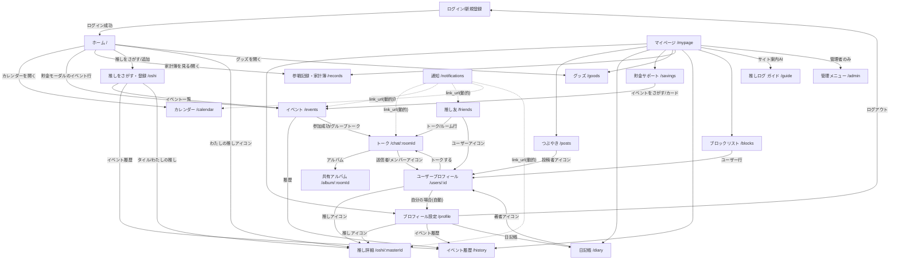

# 画面遷移一覧（推しログ / OshiLog）

ボタン・リンク単位の「遷移元 → 遷移先」の全組み合わせ。
`nav(-1)` はブラウザ履歴の「前の画面へ戻る」を表す。

## 0. 全画面共通（Layout.jsx による固定ナビ）

どの画面からでも以下へ遷移できる。

| トリガー | 遷移先 |
|---|---|
| ヘッダー 🔔 通知ベル（未読バッジ付き） | 通知 `/notifications` |
| ヘッダー ユーザー名＋アイコン | マイページ `/mypage` |
| ボトムナビ 🏠 ホーム | `/` |
| ボトムナビ 📖 予定 | `/calendar` |
| ボトムナビ ⭐ 推し | `/oshi` |
| ボトムナビ 👥 推し友 | `/friends` |
| AI相談FAB（右下 💬） | 推しログ ガイド `/guide` |
| アプリ内トースト／OS通知のタップ | 通知の `link_url`（`/chat/:roomId`・`/events?focus=ID`・`/friends`・`/calendar`・`/oshi/:id` など通知種別ごとの動的URL） |

## 1. 画面ごとの遷移

### ログイン／新規登録（ルーター外）
| トリガー | 遷移先 |
|---|---|
| ログイン成功／新規登録成功 | 本体画面（ホーム `/`）。ルーティングでなくAppの状態切替 |

### ホーム `/`（果実タップ→モーダル内のボタン）
| トリガー | 遷移先 |
|---|---|
| 「今日・直近」モーダル「カレンダーを開く」 | `/calendar` |
| 貯金モーダルのイベント行 | `/events?focus={id}&savings=1`（入出金モーダル自動オープン） |
| 「今月の推し活費」モーダル「家計簿を見る」 | `/records` |
| 「家計簿」モーダル「家計簿を開く」 | `/records` |
| 「推している人」モーダル「推しをさがす・見る」 | `/oshi` |
| 「わたしの推し」モーダルの推しアイコン | `/oshi/{oshi_master_id}`（マスター未紐付けなら `/oshi`） |
| 「わたしの推し」モーダル「推しを追加する」 | `/oshi` |
| 「グッズ」モーダル「グッズを開く」 | `/goods` |

### 推しをさがす・登録 `/oshi`
| トリガー | 遷移先 |
|---|---|
| 「🎪 イベント一覧」 | `/events` |
| 「🕘 イベント履歴」 | `/history` |
| わたしの推しのアイコン | `/oshi/{oshi_master_id}`（マスターがある場合のみ） |
| マスタータイルの画像／名前 | `/oshi/{id}` |

### 推し詳細 `/oshi/:masterId`
| トリガー | 遷移先 |
|---|---|
| 「‹ 戻る」／エラー時「戻る」 | nav(-1) |
| 「🌐 公式サイト」「🛍 グッズページ」 | 外部URL（別タブ） |

### カレンダー `/calendar`
| トリガー | 遷移先 |
|---|---|
| （ページ遷移なし。年⇄月⇄日のビュー切替・予定モーダルのみ） | - |
| 予定の「🔗 URL」 | 外部URL（別タブ） |

### 参戦記録・家計簿 `/records`、グッズ `/goods`
ページ遷移なし（タブ・モーダルで完結）。

### イベント `/events`
| トリガー | 遷移先 |
|---|---|
| 「🕘 履歴」 | `/history` |
| 「参加する」成功時（room_idが返る） | `/chat/{room_id}`（グループトークへ自動遷移） |
| 「💬 グループトーク」（参加済み） | `/chat/{room_id}` |
| 「Googleマップで開く ›」（APIキー未設定時） | 外部URL（Googleマップ） |

### イベント履歴 `/history`
| トリガー | 遷移先 |
|---|---|
| 「‹」 | nav(-1) |

### 推し友 `/friends`
| トリガー | 遷移先 |
|---|---|
| 推し友タブ「💬 トーク」 | `/chat/{room_id}` |
| トークタブのルーム行 | `/chat/{roomId}` |
| ユーザーアイコン（推し友一覧・検索結果・おすすめ・申請一覧・DM相手） | `/users/{id}` |
| 検索結果「申請が届いています」 | 画面内で申請タブへ切替（ページ遷移なし） |

### ユーザープロフィール `/users/:id`
| トリガー | 遷移先 |
|---|---|
| 「‹ 戻る」／エラー時「戻る」 | nav(-1) |
| 自分自身を開いた場合 | `/profile` へ自動リダイレクト（replace） |
| 「💬 トークする」（推し友のみ） | `/chat/{roomId}` |
| 登録している推しのアイコン | `/oshi/{oshi_master_id}` |

### トーク `/chat/:roomId`
| トリガー | 遷移先 |
|---|---|
| 「‹」／エラー時「戻る」 | nav(-1) |
| 「📸 アルバム」 | `/album/{roomId}` |
| 相手メッセージの送信者アイコン | `/users/{senderId}` |
| 参加者一覧モーダルのメンバー（自分以外） | `/users/{id}` |

### 共有アルバム `/album/:roomId`
| トリガー | 遷移先 |
|---|---|
| 「‹」 | nav(-1) |

### つぶやき `/posts`
| トリガー | 遷移先 |
|---|---|
| 投稿者のアイコン・名前 | `/users/{id}` |

### 日記帳 `/diary`
| トリガー | 遷移先 |
|---|---|
| みんなの日記の著者アイコン（自分以外） | `/users/{authorId}` |

### マイページ `/mypage`
| トリガー | 遷移先 |
|---|---|
| プロフィール要約カード／「👤 プロフィール設定」 | `/profile` |
| 「✍️ つぶやき」 | `/posts` |
| 「📔 日記帳」 | `/diary` |
| 「🐷 貯金目標一覧・AI相談」 | `/savings` |
| 「🛍 グッズ」 | `/goods` |
| 「🎫 参戦記録・家計簿」 | `/records` |
| 「🕘 イベント履歴」 | `/history` |
| 「🔒 アカウント公開設定」 | `/profile` |
| 「🚫 ブロックリスト」 | `/blocks` |
| 「💬 サイト案内AI」 | `/guide` |
| 「🛠 管理者画面」（管理者のみ表示） | `/admin` |

### 貯金サポート `/savings`
| トリガー | 遷移先 |
|---|---|
| 「イベントをさがす」（参加中イベントなし） | `/events` |
| 貯金目標カード「イベントページで入出金・目標設定 ›」 | `/events?focus={id}` |

### ブロックリスト `/blocks`
| トリガー | 遷移先 |
|---|---|
| ユーザー行タップ | `/users/{id}` |

### 通知 `/notifications`
| トリガー | 遷移先 |
|---|---|
| 通知アイテムタップ（既読化後） | 通知の `link_url`（なければ `/`） |

### プロフィール設定 `/profile`
| トリガー | 遷移先 |
|---|---|
| 登録している推しのアイコン | `/oshi/{oshi_master_id}` |
| 「🎪 イベント履歴」 | `/history` |
| 「📔 日記帳」 | `/diary` |
| 「ログアウト」 | ログイン画面（状態切替。Socket切断＋認証削除） |

### 管理メニュー `/admin`
| トリガー | 遷移先 |
|---|---|
| 「‹ 戻る」 | nav(-1) |

### 推しログ ガイド `/guide`
ページ遷移なし。

---

## 2. 画面遷移図（Mermaid）

共通ナビ（ヘッダー・ボトムナビ・FAB。上記の「全画面共通」参照）は矢印が爆発するため図から省略し、
画面固有の遷移のみを描いている。

※ 点線はサーバーが通知に付与する `link_url` に依存する動的遷移。
※ ヘッダー（→通知・マイページ）、ボトムナビ（→ホーム・カレンダー・推し・推し友）、AI相談FAB（→ガイド）は全画面から遷移可能。
