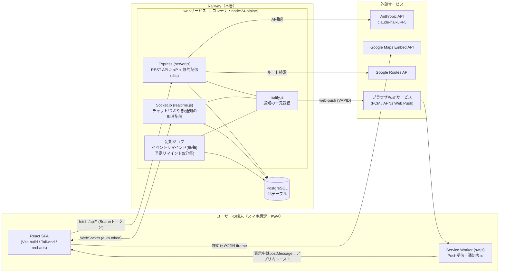

# 技術スタック・システム構成（推しログ / OshiLog）

## 1. 技術スタック一覧

### フロントエンド（frontend/）

| 技術 | バージョン | 用途 |
|---|---|---|
| React | ^19.1.0 | UIライブラリ |
| react-dom | ^19.1.0 | DOMレンダリング |
| react-router-dom | ^7.6.2 | SPAルーティング（22ルート） |
| recharts | ^3.0.2 | 家計簿グラフ（ドーナツ・棒グラフ） |
| socket.io-client | ^4.8.3 | リアルタイム通信（チャット・つぶやき・通知バッジ） |
| Vite | ^7.0.0 | ビルドツール・開発サーバー（/api と /socket.io を localhost:3000 へプロキシ） |
| TailwindCSS | ^4.1.11（@tailwindcss/vite） | スタイリング。`@theme` 変数の実行時上書きでテーマ5色を実現 |
| @vitejs/plugin-react | ^5.0.0 | Vite用Reactプラグイン |

### バックエンド（backend/）

| 技術 | バージョン | 用途 |
|---|---|---|
| Node.js | 24（Dockerfileは node:24-alpine。README要件は20以上） | 実行環境 |
| Express | ^4.21.2 | APIサーバー＋フロントの静的配信（1プロセス） |
| pg | ^8.16.0 | PostgreSQL接続（プール） |
| socket.io | ^4.8.1 | リアルタイム基盤（同一HTTPサーバーにアタッチ） |
| web-push | ^3.6.7 | Web Push（VAPID方式）送信 |
| Node標準 crypto | - | scryptパスワードハッシュ＋HMAC-SHA256トークン（外部認証ライブラリ不使用） |

### データベース

| 技術 | 用途 |
|---|---|
| PostgreSQL（Railwayのマネージドサービス） | 全データ（25テーブル）。画像もBase64文字列で保存（プロトタイプの割り切り・2MB上限） |

スキーマは起動時に `backend/db.js` が冪等に自動作成・マイグレーション（`CREATE TABLE IF NOT EXISTS`＋`ALTER TABLE ADD COLUMN IF NOT EXISTS`）。

## 2. 外部サービス・外部API

| サービス | 用途 | 備考 |
|---|---|---|
| Anthropic API（Claude） | 貯金サポートAI・サイト案内AI | モデルは `claude-haiku-4-5`（軽量モデル）。キーはサーバー環境変数のみ。貯金AIは1ユーザー1日10回制限（メモリ内カウント）。キー未設定時はルールベース応答/案内文にフォールバック |
| Google Maps Embed API | イベント会場の埋め込み地図 | キーは `/api/maps/config` 経由で実行時にフロントへ受け渡し（ソース直書きしない）。未設定時はGoogleマップへのリンクにフォールバック |
| Google Routes API | 会場→最寄り駅の公共交通ルート（TRANSIT） | サーバー側から呼び出し。所要時間・距離のみ取得（運賃は取得せず管理者のメモを表示） |
| Web Push（ブラウザのPushサービス） | プッシュ通知 | VAPID方式。iOS PWA対応（ホーム画面追加が必要）。410/404の失効購読は自動削除 |
| Railway | 本番ホスティング | web（app）＋PostgreSQLの2サービス。https://web-production-bd33b.up.railway.app |
| GitHub | ソース管理 | tarutoon7391/OshiLog。mainブランチ連携で自動デプロイ（またはCLI `railway up --ci -s web`） |

## 3. 環境変数一覧（webサービス）

| 変数 | 必須 | 用途 |
|---|---|---|
| DATABASE_URL | 必須 | PostgreSQL接続文字列（Railwayでは `${{Postgres.DATABASE_URL}}` 参照変数） |
| TOKEN_SECRET | 必須（未設定時は開発用既定値） | 認証トークンのHMAC署名鍵 |
| PORT | 任意（既定3000） | HTTPポート |
| VAPID_PUBLIC_KEY / VAPID_PRIVATE_KEY | 任意 | Web Push用VAPID鍵。未設定なら通知機能のみ無効 |
| VAPID_SUBJECT | 任意 | VAPIDの連絡先（既定 mailto:oshilog@example.com） |
| ANTHROPIC_API_KEY | 任意 | AI機能。未設定でもルールベースで動作 |
| GOOGLE_MAPS_API_KEY | 任意 | 地図・ルート。未設定なら地図はリンク表示・ルート非表示 |
| NODE_ENV | - | Dockerfileで production を設定 |

## 4. デプロイ構成

- **1コンテナ構成**（Dockerfile）: フロントを `vite build` でビルド → Express が `frontend/dist` を静的配信＋`/api`＋Socket.io を同一ポートで担当。
- `railway.json`: DOCKERFILEビルド・起動コマンド `node backend/server.js`・ヘルスチェック `/api/health`（タイムアウト100秒）・失敗時は最大10回再起動。
- デプロイ方法: GitHub `main` へのpushで自動デプロイ（推奨）、または `railway up --ci -s web`。
- 起動シーケンス: DB接続リトライ（3秒×最大10回）→ DDL適用＋マイグレーション＋シード → Web Push設定 → HTTP+Socket.io起動 → リマインドジョブ開始（イベント: 6時間ごと / 予定: 5分ごと）。
- プロセス保険: `unhandledRejection` / `uncaughtException` をログのみで握りつぶしてプロセス継続（可用性優先）。

## 5. システム構成図（Mermaid）



## 6. 認証・セキュリティ設計の要点

- パスワード: scrypt（ソルト付き）でハッシュ化。比較は `timingSafeEqual`（タイミング攻撃対策）。
- トークン: `userId.HMAC-SHA256署名`。REST は `Authorization: Bearer`、Socket.io は `handshake.auth.token` で検証。
- 権限判定はすべてサーバー側: 管理者判定（DBのis_admin）、本人所有チェック（SQLのWHERE条件）、ルームメンバー検証、公開範囲判定（visibilityWhere共通関数）、ブロック判定。
- ブロックの秘匿: ブロックされている事実がAPIレスポンス・既読・申請結果から漏れないよう設計（成功したふり応答など）。
- URL検証: 予定の関連URLは http/https のみ許可（javascript:等を拒否）。着せ替え選択は承認済み画像のみ許可。
- APIキー（Anthropic・Google Maps）はサーバー環境変数のみで管理し、フロントのソースに直書きしない。

## 7. リポジトリ構成

```
OshiLog/
├── backend/            # Expressサーバー
│   ├── server.js       # 全APIルート・定期ジョブ・静的配信（約1,600行）
│   ├── db.js           # DB接続・DDL・マイグレーション・シード
│   ├── auth.js         # scryptハッシュ・HMACトークン
│   ├── realtime.js     # Socket.io（ルーム設計・チャット・既読）
│   ├── notify.js       # 通知の一元送信（カテゴリ判定→履歴記録→Push）
│   ├── push.js         # web-push（VAPID）ラッパー
│   └── ai.js           # Anthropic API（貯金サポートAI・サイト案内AI）
├── frontend/
│   ├── src/
│   │   ├── App.jsx     # ルーティング・認証ガード
│   │   ├── api.js      # fetchラッパー（Bearer付与・401処理）
│   │   ├── socket.js   # Socket.io接続
│   │   ├── pwa.js      # SW登録・Push購読
│   │   ├── theme.js    # テーマ5色
│   │   ├── util.js     # 共通定数・関数
│   │   ├── components/ # Layout / ui / Toast / PullToRefresh
│   │   └── pages/      # 22画面
│   ├── public/         # manifest.json / sw.js / アイコン
│   └── dist/           # ビルド成果物（Expressが配信）
├── docs/               # 設計資料（本フォルダ）
├── Dockerfile          # フロントビルド＋バックエンドの1コンテナ
├── railway.json        # Railwayデプロイ設定
└── README.md
```
